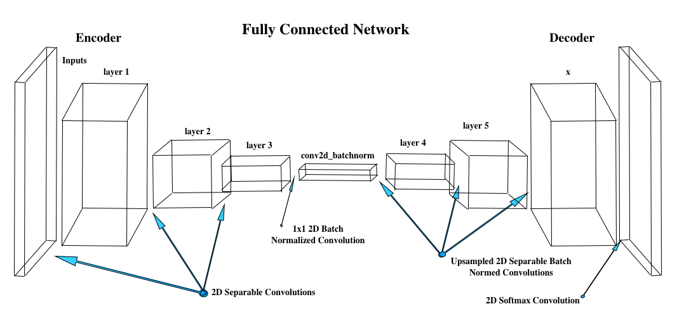

## Deep Learning Project ##
### Satinderjit Singh

[image_0]: ./misc/sim_screenshot.png
![alt text][image_0] 

CNN consists of convolution layers followed by fully connected layers and finally a softmax activation function. This works well for classification tasks.
If we want to find a particular item in picture the CNN maynot work as fully connected layers doesnot retain any spatial information.

If we change Fully connected layer to convolution layer we get fully convolution networks (FCN)

The size of input doesnt matter for convolution so FCNs can work on any size of input.

FCNs help in semantic segmentation. FCNs works with three techniques.
- It replaces fully connected layers with 1x1 convolution layers
- Upsampling through the use of transposed convolutional layers
- Skip connections


##### 1X1 convolution
In 1x1 convolution the tensor remains 4D instead of getting flattened to 2D. Hence the spatial information is preserved.

A 1x1 convolution is essentially convolving with a set of filters of dimensions:

1x1xfilter_size (HxWxD),
stride = 1, and
zero (same) padding.


##### Transposed convolution
It is reverse convolution where foward and backward passed are swapped.

##### Skip Connections
The global information is lost in encoder blocks as we look at patches. Skip connection helps to retain that information. The output of one layer is connected to non-adjacent layer.


This project implements a fully convolutional Deep Neural Network (FCN) for semantic segmentation. Semantic segmentation  accurately segments to the actual shape of the object unlike bounding boxes. The DNN learns and later identifies and tracks a target in simulation. This target is called the `hero` throughout this documentation. 


##### FCN:Decoder
The FCN decoder can be made up of bilinear upsampling. It uses the weighted average of 4 nearest known pixels located diagonally to known pixel.
The bilinear upsampling layer is not a learning layer and lose some finer details, in addition it helps speed up performance.

The network architecture is composed of following layers
- 3 encoder layers
- 1x1 conv layer
- 3 decoder layers


<table align="center"> 
    <caption><b>FCN Model - Figure 3</boldbcaption>
    <tr>
        <td>
            
        </td>
    </tr>
</table>

The steps are detailed below:

## Step 1 -  Separable Convolutions
Separable convolutions, comprise of a convolution performed over each channel of an input layer and followed by a 1x1 convolution that takes the output channels from the previous step and then combines them into an output layer.

The number of parameters are much less compared to regular convolutions which improves runtime performance.

## batch normalization
* Batch normalization allows higher learning rates with less care for initialization
* It acts as regularlizer and eliminate the need for Dropout

## Step 2 - Bilinear Upsampling

The function `bilinear_upsample()` provided implements the bilinear upsampling layer. Bilinear upsampling uses the weighted average of four nearest pixels, diagonal to a given pixel, to estimate a new pixel value. It is used in the decoder block to upsample the input to the larger layer.

## Step 3 - Building the Model 

The steps in building the model are:
* Create an encoder_block
* Create a decoder_block
* Build the FCN consisting of encoder blocks, a 1x1 convolution, and decoder blocks. 

### The Encoder Block

The encoder block includes a separable convolution layer using the `separable_conv2d_batchnorm()` function:

```
def encoder_block(input_layer, filters, strides):
    output_layer = separable_conv2d_batchnorm(input_layer, filters, strides=strides)
    return output_layer
```

### Decoder Block
The decoder block is comprised of three parts:
- A bilinear upsampling layer using the upsample_bilinear() function. The current recommended factor for upsampling is set to 2.
- A layer concatenation step. This step is similar to skip connections. You will concatenate the upsampled small_ip_layer and the large_ip_layer.
- Some (one or two) additional separable convolution layers to extract some more spatial information from prior layers.

```
def decoder_block(small_ip_layer, large_ip_layer, filters):
    
    # TODO Upsample the small input layer using the bilinear_upsample() function.
    sampled = bilinear_upsample(small_ip_layer)

    # TODO Concatenate the upsampled and large input layers using layers.concatenate
    cat = layers.concatenate([sampled, large_ip_layer])

    # TODO Add some number of separable convolution layers
    conv1 = separable_conv2d_batchnorm(cat, filters=filters, kernel_size=1, strides=1)
    conv2 = separable_conv2d_batchnorm(conv1, filters=filters, kernel_size=1, strides=1)
    output_layer = separable_conv2d_batchnorm(conv2, filters=filters, kernel_size=1, strides=1)
    return output_layer
```

### The FCN Model

There are three steps in building the model:
* Encoder blocks to build the encoder layers.
* A 1x1 Convolution layer using the `conv2d_batchnorm()` function, with a kernel_size and stride of 1.
* The same number of decoder blocks for the decoder layers to recreate to the original image size.

```
def fcn_model(inputs, num_classes):
    # add some number of Encoder blocks
    layer1 = encoder_block(inputs, 32, strides=2)
    layer2 = encoder_block(layer1, 64, strides=2)
    layer3 = encoder_block(layer2, 64, strides=2)    
    # Add 1x1 Convolution layer using conv2d_batchnorm().
    conv2d_batchnormed = conv2d_batchnorm(layer3, 64, kernel_size=1, strides=1)
    # Add the same number of Decoder Blocks as the number of Encoder Blocks
    layer4 = decoder_block(conv2d_batchnormed, layer2, 64)
    layer5 = decoder_block(layer4, layer1, 64)
    x = decoder_block(layer5, inputs, 32)
    # The function returns the output layer of your model. "x" is the final layer obtained from the last decoder_block()
    return layers.Conv2D(num_classes, 3, activation='softmax', padding='same')(x)
 ```
 

## Step 4 - Training
On my Macbook Air I ran will following parameters to check for errors in code and see how good these parameters results are.
learning_rate = 1
batch_size = 64
num_epochs = 5
steps_per_epoch = 10
validation_steps = 50
workers = 2

The result was very bad IOU and final score was both '0' and validation loss was > 10

All the following trainings were done on AWS
Reduced learning rate to 0.1
Still IOU and final score remained at '0' with validation loss of 7.95

Reduced learning rate to 0.01
Valid loss reduced to 0.1322 and Final score was 0.03

Increased steps_per_epoch to 100 and see validation loss reduced to 0.072
but no improvement in IOU and Final Score

Increased num_epochs = 10 and see Final Score improved marginally to 0.25 and Validation Loss reduced to 0.0488

Increased  steps_per_epochs = 200 and saw validation loss reduced to 0.039 and final score  still remained at 0.29


Finally settled for following 
learning_rate = 0.01
batch_size = 64
num_epochs = 20
steps_per_epoch = 400
validation_steps = 50
workers = 2

## Step 5 - Prediction

* Scores for while the quad is following behind the target.
      number of validation samples intersection over the union evaulated on 542
      average intersection over union for background is 0.9941827831321841
      average intersection over union for other people is 0.2884075906302439
      average intersection over union for the hero is 0.8555500256420691
      number true positives: 539, number false positives: 0, number false negatives: 0


* Scores for images while the quad is on patrol and the target is not visible
      number of validation samples intersection over the union evaulated on 270
      average intersection over union for background is 0.981282477843907
      average intersection over union for other people is 0.6251760579059025
      average intersection over union for the hero is 0.0
      number true positives: 0, number false positives: 119, number false negatives: 0


* This score measures how well the neural network can detect the target from far away
      number of validation samples intersection over the union evaulated on 322
      average intersection over union for background is 0.9952181401297582
      average intersection over union for other people is 0.38808783798777147
      average intersection over union for the hero is 0.20167453310681088
      number true positives: 173, number false positives: 4, number false negatives: 128

* And the final grade score is
 0.390832754844
